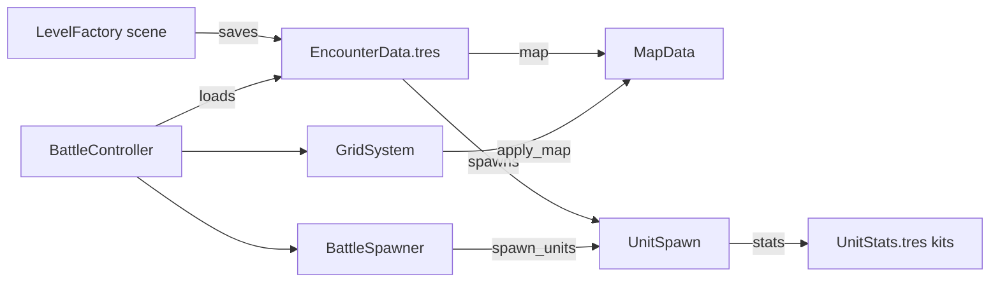

# Level Factory (Encounter Authoring)

**Status:** Planned (not implemented)  
**Overview:** Add authorable Encounter/Map resources and a visual LevelFactory scene to place units and paint cover, then wire BattleController to load those assets instead of hardcoded setup.

## Goal

Replace hardcoded battle setup with data Resources plus a visual placement scene so levels (units + stage cover) can be authored and loaded into battle.

Aligns with [PROJECT_EVALUATION.md](../PROJECT_EVALUATION.md) steps 1–2: resource-driven encounters and map-authored cover.

## Scope (locked)

- Data layer: `MapData`, `EncounterData`, Resource-based `UnitSpawn` / cover entries
- Visual LevelFactory scene: place units, paint cover, save/load `.tres`
- Wire [battle_controller.gd](../scripts/battle/battle_controller.gd) to `@export` an encounter
- Keep `GridMath.GRID_SIZE` (12×12) fixed; no walkability/height painting in this milestone

## Architecture



## Todos

1. Add CoverEntry, MapData, EncounterData; make UnitSpawn a Resource
2. Migrate default cover + spawns/kits into `data/*.tres` assets
3. `GridSystem.apply_map` + BattleController `@export` encounter
4. Build LevelFactory scene: place units, paint cover, save/load
5. Add `docs/level-factory.md` (usage guide) and mark PROJECT_EVALUATION steps 1–2 done

## 1. Data resources

| Resource | Path | Fields |
| --- | --- | --- |
| `CoverEntry` | `scripts/data/cover_entry.gd` | `pos: Vector2i`, `cover: BattleEnums.Cover`, `dirs: Array[BattleEnums.Direction]` |
| `MapData` | `scripts/data/map_data.gd` | `cover_entries: Array[CoverEntry]` |
| `UnitSpawn` | change [unit_spawn.gd](../scripts/data/unit_spawn.gd) | `extends Resource`; `@export` `team`, `grid_pos`, `stats` |
| `EncounterData` | `scripts/data/encounter_data.gd` | `map: MapData`, `spawns: Array[UnitSpawn]` |

Migrate current content:

- Cover from [grid_system.gd](../scripts/systems/grid_system.gd) `_cover_layout` → `res://data/maps/default_map.tres`
- Spawns/kits from [default_battle_setup.gd](../scripts/data/default_battle_setup.gd) → `res://data/encounters/default_encounter.tres` plus kit `.tres` under `res://data/units/` (Warrior, Warlock, Raider, Guard, Sniper)

Keep `DefaultBattleSetup` only as a temporary builder used once to generate those assets (or delete after migration and author kits in Inspector).

## 2. Runtime wiring

**GridSystem** — remove hardcoded `_cover_layout`; add:

```gdscript
func apply_map(map: MapData) -> void:
    _build_tiles()  # empty grid
    for entry in map.cover_entries:
        # same edge-cover loop as today
```

Call `apply_map` before spawn (from BattleController or GridSystem init with injected map).

**BattleController** — replace:

```gdscript
DefaultBattleSetupScript.get_unit_spawns()
```

with:

```gdscript
@export var encounter: EncounterData
# apply encounter.map to grid_system, then spawn encounter.spawns
```

Default the export to `default_encounter.tres` so `Battle.tscn` still boots unchanged.

**BattleSpawner** — unchanged API once `UnitSpawn` remains `team` / `grid_pos` / `stats`.

## 3. LevelFactory scene

New scene: `scenes/editor/LevelFactory.tscn` + `scripts/editor/level_factory_controller.gd`.

Reuse battle world pieces where cheap:

- Instance or duplicate minimal board: `GridSystem` + `GridView` + `CameraRig` (no TurnManager / AI / BattleUI combat loop)
- On load: `apply_map`, spawn preview units from encounter (visual markers or real `Unit.tscn` in a non-combat setup)

Editor UI (Control overlay):

- Load / Save encounter path (FileDialog → `.tres`)
- Mode toggle: **Place Unit** | **Paint Cover** | **Erase**
- Place Unit: pick archetype (`UnitStats` from a kit list), pick team, click tile → add/replace `UnitSpawn`
- Paint Cover: pick HALF/FULL + edge dirs (or “all dirs”), click tile → upsert `CoverEntry`
- Erase: click clears spawn or cover on that tile
- List panel: spawns + cover entries for quick select/delete

Persistence: build `EncounterData` / `MapData` in memory and `ResourceSaver.save()`.

Entry: add a note in docs (or a temporary main-scene swap) so the scene can be run from the editor; do not change `project.godot` main scene permanently from Battle.

## 4. Project docs

Write [level-factory.md](level-factory.md) describing:

- Resource types and folder layout (`data/maps`, `data/units`, `data/encounters`)
- How to run LevelFactory and save an encounter
- How to assign the encounter on `Battle.tscn` / BattleController
- Update [PROJECT_EVALUATION.md](../PROJECT_EVALUATION.md) suggested steps 1–2 as done when implemented

## 5. Out of scope

- Variable grid size, walkability, height
- Line-of-sight, new combat modifiers
- Menu / campaign flow between levels
- Full Godot `@tool` Inspector plugin (in-game scene is enough)

## Implementation order

1. Resources + migrate default map/encounter/kits
2. GridSystem `apply_map` + BattleController export
3. LevelFactory scene (place units, then cover paint, then save/load)
4. Docs update

## Key reuse

- [battle_spawner.gd](../scripts/battle/battle_spawner.gd) for preview/live spawn
- [grid_view.gd](../scripts/systems/grid_view.gd) `tile_picked` / hover for editing
- Existing cover apply loop in `GridSystem._build_tiles`
- `UnitStats` already Inspector-friendly for kits
